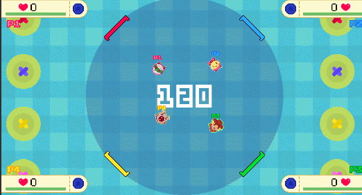

# Bounce Punch! repo

This is a repository for Bounce Punch!, a 4-player local-multiplayer fighting game played in a circular pong arena, made by **Andreas Sturmer** (remruts)  

You may find builds and more info about the game at [https://remruts.itch.io/bounce-punch](https://remruts.itch.io/bounce-punch)

For music, font credits and all that check the game credits page. You may use the code and graphics in this game as long as you give appropriate credits. Though I probably copy-pasted some code...
